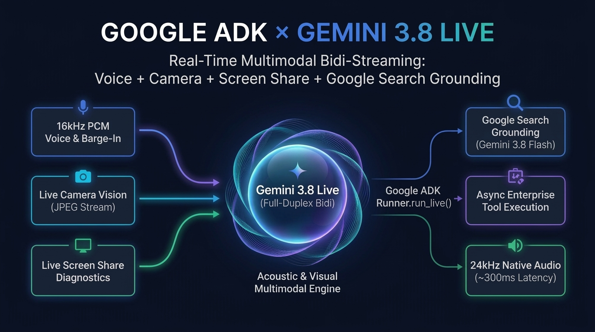

# Google ADK × Gemini 3.8 Live Multimodal Voicebot Studio



**Google Agent Development Kit (ADK)** ve **Google Cloud Gemini Enterprise** üzerindeki **Gemini 3.8 Live (`gemini-3.8-live`)** ile **Gemini 3.8 Flash (`gemini-3.8-flash`)** modellerini kullanarak gerçek zamanlı **Ses + Kamera + Ekran Paylaşımı (Multimodal Bidi-Streaming)** ve **Canlı Google Search Grounding** yeteneklerini 6 sektörel senaryoda deneyimlemek için tasarlanmış açık kaynaklı referans mimari ve demo platformu.

---

## ✨ Öne Çıkan Teknik Yetenekler

- **Uçtan Uca Multimodal Live API (`gemini-3.8-live`):** Araya harici STT/TTS koymadan, 16kHz PCM mikrofon sesini ve 1 FPS JPEG **Kamera / Ekran Paylaşımı** karelerini (`send_realtime_input(audio=..., video=...)`) aynı WebSocket oturumunda gerçek zamanlı işler ve 24kHz PCM ses ile yanıtlar.
- **Google ADK (`Runner.run_live` & `LiveRequestQueue`) Orkestrasyonu:** Sesli ve görsel diyalog devam ederken arka planda asenkron Python araçlarını (`ALL_TOOLS`) tetikler, dönen yapılandırılmış verileri anlık olarak arayüzdeki **Canlı Müşteri Ekranı & Aksiyon Kartları** paneline yansıtır.
- **Canlı Google Search Grounding (`google_web_search`):** Tüm sektörel ajanlar, `gemini-3.8-flash` + `types.Tool(google_search=types.GoogleSearch())` kullanarak güncel döviz/altın kurlarını, ürün fiyatlarını, global teknik kesintileri veya medikal rehberleri gerçek zamanlı web kaynaklarıyla doğrulayarak getirir.
- **Kesintisiz Uzun Oturumlar (`ContextWindowCompressionConfig`):** Kamera ve ses akışının uzun süreli oturumlarda bağlam limitine takılmaması için `SlidingWindow()` tabanlı bağlam sıkıştırma mimarisi içerir.
- **Barge-In (Anlık Söz Kesme):** Asistan konuşurken kullanıcı araya girdiğinde (`interrupted=True`), tarayıcıdaki Web Audio API tamponu milisaniyeler içinde temizlenir ve asistan dinleme moduna geçer.

---

## 🚀 Kurulum ve Hızlı Başlatma (Lokal)

### 1. Ön Koşullar
- Python 3.10+
- Google Cloud SDK (`gcloud`) ve Vertex AI API etkinleştirilmiş bir GCP projesi

```bash
gcloud auth login
gcloud auth application-default login
gcloud config set project YOUR_GCP_PROJECT_ID
```

### 2. Bağımlılıkların Kurulumu ve Yapılandırma
```bash
git clone https://github.com/emrahmete/gemini-live-voicebot-studio.git
cd gemini-live-voicebot-studio

python3 -m venv .venv
.venv/bin/pip install -r requirements.txt

# İsteğe bağlı: .env dosyasını oluşturun (oluşturmazsanız aktif gcloud projeniz otomatik algılanır)
cp .env.example .env
```

### 3. Uygulamayı Çalıştırma
```bash
chmod +x run_demo.sh
./run_demo.sh
```

Tarayıcınızdan şu adresi açın:
👉 **[http://localhost:8090](http://localhost:8090)**

---

## 🧠 Desteklenen 3 Canlı Mimari Mod (Arayüzden Anlık Seçilebilir)

1. **Mod 1 — Gemini 3.8 Live Native Audio & Vision Bidi-Streaming (`gemini-3.8-live` + `gemini-3.8-flash` Sub-Agent)**
   - **Bölge**: `us-central1` (`gemini-3.8-live`) + `global` (`gemini-3.8-flash` Derin Analiz & Google Search Grounding)
   - **Özellikler**: Ultra-düşük gecikmeli uçtan uca (Speech-to-Speech) sesli konuşma, **Interleaved Reasoning**, **Proactive Audio**, **Barge-In (Söz Kesme)**, **Kamera & Ekran Paylaşımı (Multimodal Live Vision)** ve ADK üzerinden canlı tool çağrıları.
2. **Mod 2 — Hibrit Kurumsal Boru Hattı (`gemini-3.8-live` ASR ➔ `gemini-3.8-flash` ➔ `gemini-2.5-flash-tts`)**
   - **Özellikler**: Düzenlemeye tabi sektörler için tam metin denetimli akış. Kullanıcı sesini gerçek zamanlı metne döker, `gemini-3.8-flash` ADK ajanı ile muhakeme & araç çağrılarını çalıştırır ve `gemini-2.5-flash-tts` ile 24kHz PCM ses üretir.
3. **Mod 3 — Canlı Transkripsiyon & Çağrı Merkezi Agent Assist (`gemini-3.8-live` ASR + `gemini-3.8-flash`)**
   - **Özellikler**: Müşteri temsilcisi (Agent Assist) ve kalite yönetimi senaryosu. Konuşmayı gerçek zamanlı metne dökerken arka planda `gemini-3.8-flash` ile **Duygu Skoru (0-100)**, **Müşteri Niyeti**, **Sonraki En İyi Aksiyon (Next Best Action)** ve **Post-Call CRM Özeti** üretir.

---

## 🎯 Ekran Üzerinden Demolanabilen 6 Sektörel Use-Case

| # | Senaryo | Öne Çıkan Gemini 3.8 Live & Multimodal Yeteneği | Tetiklenen ADK Araçları & Canlı Kartlar |
|---|---|---|---|
| 1 | **🏦 Bankacılık & Finans VIP Concierge** | Barge-in ile acil kart dondurma & Google Search ile canlı döviz/altın kuru | `get_bank_account_summary`, `toggle_card_security_lock`, `calculate_loan_or_deposit_offer`, `google_web_search`, `analyze_with_gemini_38_flash` |
| 2 | **🛒 E-Ticaret & Görsel İade / Kargo** | **Kamera Paylaşımı** ile hasarlı ürünü gösterip anında QR İade Kodu alma & canlı fiyat karşılaştırma | `check_order_status`, `approve_instant_return_or_compensation`, `google_web_search` |
| 3 | **🔧 Teknik Destek & Saha Görsel Asistanı** | **Ekran / Kamera Paylaşımı** ile hata ekranını veya modem ışığını inceleme & uzaktan hat sıfırlama | `run_remote_device_diagnostics`, `reset_and_optimize_device_line`, `google_web_search` |
| 4 | **🏥 Dijital Sağlık Triyaj & Randevu** | Empatik sesli iletişim, güncel medikal rehber sorgulama & canlı ön-triyaj hasta kartı oluşturma | `check_clinic_slots`, `book_medical_appointment`, `google_web_search` |
| 5 | **🌍 Canlı Simültane Tercüman** | TR ⇄ EN/DE/ES doğal tonlamalı çift yönlü çeviri, canlı haber doğrulama & iki dilli toplantı özeti | `google_web_search`, `analyze_with_gemini_38_flash` |
| 6 | **🎙️ Çağrı Merkezi Kalite & Agent Assist** | Canlı ASR + `gemini-3.8-flash` ile gerçek zamanlı kalite, duygu ve mevzuat kartları | Tüm iş araçları + `google_web_search` + `analyze_with_gemini_38_flash` |

---

## 🔒 Üretim (Production) Güvenlik Notları
- Bu proje lokal geliştirme ve referans mimari gösterimi için tasarlanmıştır.
- Bulut ortamına (örn. Cloud Run / GKE) açmadan önce `ALLOWED_ORIGINS` değişkenini kendi alan adınızla sınırlandırın ve `/ws/live` WebSocket uç noktasına kimlik doğrulama (IAM / IAP / OAuth2 Bearer Token) ekleyin.
